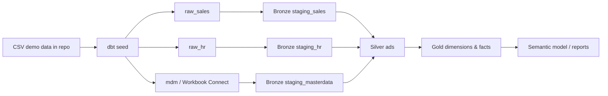

# Fabric dbt Accelerator

Demo `dbt-fabric` project for Microsoft Fabric Warehouse, designed as a starter template for Plainsight projects.

This repository demonstrates:

- Bronze / Silver / Gold layering using Plainsight semantics:
  - Bronze = `landing` / `staging` source-aligned models
  - Silver = ADS integrated analytical models
  - Gold = business-ready dimensions and facts
- Demo data as CSV files in the repository via dbt seeds.
- Multiple demo sources: Sales, HR, and Master Data.
- Workbook Connect as the master-data editing workflow for business-maintained mappings.
- Deterministic `BIGINT` primary and foreign keys generated from SHA2-based hashes.
- Model/source documentation, tests, exposures, SQLFluff config, and GitHub Actions CI skeleton.

> Target platform: **Microsoft Fabric Warehouse** via `dbt-fabric`.
> Fabric SQL analytics endpoints are read-only and are therefore not used as dbt transformation targets.

## Repository structure

```text
.
├── .github/workflows/ci.yml
├── .vscode/extensions.json
├── analysis/
├── docs/
│   ├── ARCHITECTURE.md
│   ├── ONBOARDING.md
│   └── WORKBOOK_CONNECT.md
├── macros/
│   ├── generate_schema_name.sql
│   └── hash_bigint.sql
├── models/
│   ├── bronze/
│   │   └── staging/
│   ├── silver/
│   │   └── ads/
│   └── gold/
│       └── marts/
├── seeds/
│   ├── mdm/
│   ├── raw_hr/
│   └── raw_sales/
├── tests/
├── dbt_project.yml
├── packages.yml
├── profiles.yml.example
└── .sqlfluff
```

## Quick start

### 1. Create and activate a Python environment

```bash
python -m venv .venv
source .venv/bin/activate  # Windows PowerShell: .venv\Scripts\Activate.ps1
pip install -r requirements.txt
```

### 2. Install dbt packages

```bash
dbt deps
```

### 3. Create your local dbt profile

Copy the example profile and fill in your Fabric Warehouse details.

```bash
cp profiles.yml.example profiles.yml
```

Then edit:

- `host`: SQL endpoint of the Fabric Warehouse
- `database`: Warehouse name
- `schema`: personal/dev schema, for example `dev_lennert`

For local development with Azure CLI auth:

```bash
az login
dbt debug --profiles-dir .
```

### 4. Load demo CSV data

```bash
dbt seed --profiles-dir .
```

This creates demo raw tables from the CSV files in `seeds/`.

### 5. Build Bronze, Silver, and Gold

```bash
dbt build --profiles-dir .
```

Useful targeted commands:

```bash
dbt build --select tag:bronze --profiles-dir .
dbt build --select tag:silver --profiles-dir .
dbt build --select tag:gold --profiles-dir .
dbt docs generate --profiles-dir .
dbt docs serve --profiles-dir .
```

## Expected data flow



## Demo business process

This project models a small sales domain:

- Sales source: customers, products, orders, order lines.
- HR source: sales reps, teams, and regions.
- Master Data source: product category mappings maintained by the business through Workbook Connect.

Gold outputs:

- `dim_customer`
- `dim_product`
- `dim_sales_rep`
- `dim_date`
- `fact_sales`

## Bigint hash keys

Use `{{ hash_bigint([...]) }}` for deterministic `BIGINT` keys. Example:

```sql
{{ hash_bigint(["'sales'", 'customer_id']) }} as customer_pk
```

This returns a non-negative `BIGINT` derived from `HASHBYTES('SHA2_256', ...)` and keeps facts and dimensions joinable using whole-number keys.

## Workbook Connect flow

Workbook Connect is used for the `mdm_product_category_mapping` table. The CSV in `seeds/mdm/` initializes demo data. In a real Fabric Warehouse, business users maintain that table via Workbook Connect, and dbt treats it as a source feeding Bronze/Silver/Gold.

See [`docs/WORKBOOK_CONNECT.md`](docs/WORKBOOK_CONNECT.md).

## CI

The GitHub Actions workflow is intentionally conservative:

- `dbt deps`
- `dbt parse`
- `sqlfluff lint models macros tests`

Warehouse execution (`dbt build`) is left as an optional step because it requires Fabric credentials and a reachable Fabric Warehouse.

## Success criteria checklist

- [x] Bronze/Silver/Gold split.
- [x] Demo CSV data committed in `seeds/`.
- [x] Documentation in README, docs folder, and dbt YAML descriptions.
- [x] Multiple sources: Sales, HR, Master Data.
- [x] Workbook Connect master-data workflow documented.
- [x] `BIGINT` primary keys generated from hashes.
- [x] Tests and CI skeleton.
