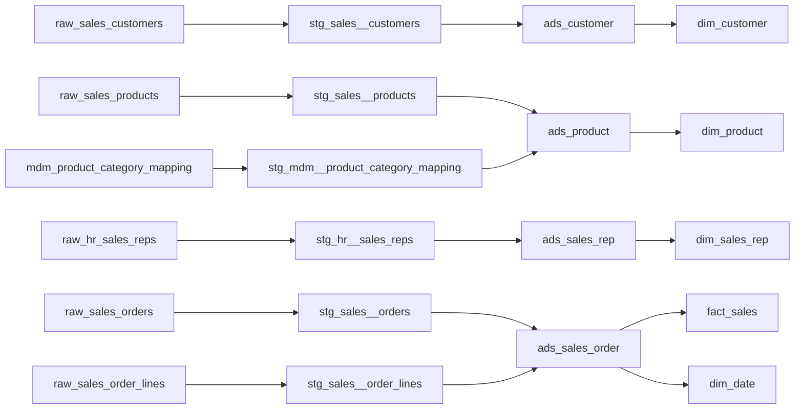

# Architecture

## Design decision

This accelerator targets **Microsoft Fabric Warehouse** with the `dbt-fabric` adapter. It uses schemas to represent Plainsight layers:

| Medallion | Plainsight semantic layer | Demo schemas | Responsibility |
|---|---|---|---|
| Bronze | Landing/Staging | `raw_sales`, `raw_hr`, `mdm`, `staging_sales`, `staging_hr`, `staging_masterdata` | Raw or source-aligned data with minimal transformations and audit fields. |
| Silver | ADS | `ads` | Cleansed, integrated, conformed entities ready for business modeling. |
| Gold | Business products | `gold` | Dimensional model for semantic models and reporting. |

## Source systems

1. **Sales**: operational order/customer/product data.
2. **HR**: sales-rep organization data.
3. **Master Data**: business-owned product category mappings maintained through Workbook Connect.

## Why the Master Data layer matters

Product categories are intentionally not hardcoded in SQL. They are treated as governed reference data. The CSV seed initializes the demo table, but the intended production workflow is:

1. Fabric Warehouse hosts `mdm.mdm_product_category_mapping`.
2. Business owners edit it through Workbook Connect from Excel.
3. dbt reads it through the `master_data` source.
4. Silver `ads_product` enriches products with category attributes.
5. Gold `dim_product` exposes the business-ready category hierarchy.

## Key strategy

All analytical PK/FK columns use whole-number keys:

- Dimension keys: `customer_key`, `product_key`, `sales_rep_key`, `date_key`.
- Fact key: `sales_fact_key`.
- Relationship keys in facts are `BIGINT` except `date_key`, which uses `YYYYMMDD` integer convention.

The `hash_bigint` macro makes keys deterministic across runs and environments.

## Model lineage

